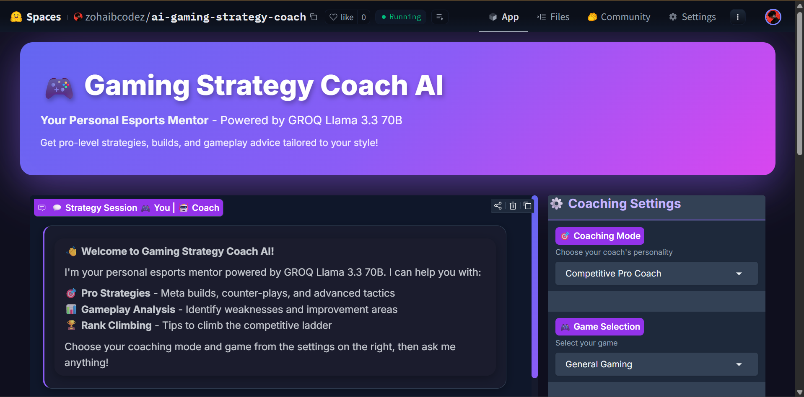

# 🎮 AI Gaming Strategy Coach Chatbot | GROQ + Gradio + Hugging Face

[](https://www.python.org/downloads/)
[](https://gradio.app/)
[](https://groq.com/)
[](https://opensource.org/licenses/MIT)
[](https://huggingface.co/spaces)

> **Professional AI-Powered Gaming Coach** | Dynamic System Prompts | Multi-Game Support | Real-time Strategy Advice

An advanced AI chatbot that serves as your personal esports mentor, offering expert gaming strategies, builds, and gameplay analysis across 9+ popular competitive games using GROQ's powerful Llama 3.1 70B language model.

## 🌟 Live Demo

🚀 **[Try the Live App on Hugging Face →](YOUR_HUGGINGFACE_SPACE_LINK_HERE)**



---

## ✨ Key Features

### 🎯 **4 Dynamic Coaching Modes**
- **Competitive Pro Coach** - META strategies, rank climbing tactics, competitive mindset
- **Casual Fun Guide** - Relaxed advice, creative plays, enjoyment-focused
- **Educational Analyst** - Deep mechanics, theory, mathematical analysis
- **Hype Man** - Motivational support, confidence building, tilt prevention

### 🎮 **Multi-Game Support**
Built-in expertise for:
- Valorant (Agent strategies, map control, economy)
- League of Legends (Champion mechanics, macro gameplay)
- CS2/CS:GO (Utility usage, positioning, economy)
- Fortnite (Building, rotation, loadout optimization)
- Apex Legends (Legend synergies, movement)
- Dota 2 (Hero mechanics, itemization)
- Overwatch 2 (Hero counters, composition)
- Rocket League (Rotation, mechanics, boost management)
- General Gaming (Universal strategies)

### ⚡ **Interactive UI Features**
- Response detail slider (1-10 scale)
- Quick action buttons (Build Guides, Counter Strategies, Meta Analysis)
- Real-time coaching mode switching
- Game-specific context adaptation
- Clean, gaming-themed gradient interface

---

## 🛠️ Technology Stack

| Technology | Purpose |
|------------|---------|
| **GROQ API** | High-performance LLM inference |
| **Llama 3.1 70B** | Advanced language model |
| **Gradio** | Interactive web UI framework |
| **Python 3.8+** | Backend development |
| **Hugging Face Spaces** | Cloud deployment platform |

---

## 🚀 Quick Start

### Prerequisites
- Python 3.8 or higher
- GROQ API key ([Get one free](https://console.groq.com))
- pip package manager

### Local Development Setup

1. **Clone the repository**
```bash
git clone https://github.com/YOUR_USERNAME/ai-gaming-strategy-coach-chatbot.git
cd ai-gaming-strategy-coach-chatbot
```

2. **Create virtual environment**
```bash
python -m venv venv
source venv/bin/activate  # Mac/Linux
venv\Scripts\activate     # Windows
```

3. **Install dependencies**
```bash
pip install -r requirements.txt
```

4. **Set up environment variables**
```bash
# Create .env file
echo "GROQ_API_KEY=your_groq_api_key_here" > .env
```

5. **Run the application**
```bash
python app.py
```

6. **Open in browser**
```
http://localhost:7860
```

---

## 📦 Installation

```bash
# Clone repository
git clone https://github.com/YOUR_USERNAME/ai-gaming-strategy-coach-chatbot.git

# Navigate to project
cd ai-gaming-strategy-coach-chatbot

# Install requirements
pip install -r requirements.txt

# Run application
python app.py
```

---

## 🔧 Configuration

### Environment Variables

| Variable | Description | Required |
|----------|-------------|----------|
| `GROQ_API_KEY` | Your GROQ API authentication key | Yes |

### Model Configuration

Edit `app.py` to change the LLM model:

```python
MODEL_NAME = "llama-3.1-70b-versatile"  # Current
# Alternatives:
# "llama-3.3-70b-versatile"  # Newer, more capable
# "mixtral-8x7b-32768"       # Longer context window
```

---

## 📖 Usage Examples

### Ask General Questions
```
"What's the best way to improve my aim in FPS games?"
"How do I climb ranks faster in Valorant?"
```

### Get Specific Strategies
```
"Give me a beginner-friendly champion for League of Legends"
"What's the current meta build for Jett in Valorant?"
```

### Request Analysis
```
"Analyze the current Overwatch 2 meta"
"What are common mistakes in CS2 competitive?"
```

### Quick Actions
- Click **Build Guide** for meta builds
- Click **Counter Strategy** for opponent counters
- Click **Improve Gameplay** for personalized tips
- Click **Meta Analysis** for current game state

---

## 🎨 Customization

### Add New Coaching Modes

Edit the `COACHING_MODES` dictionary in `app.py`:

```python
COACHING_MODES = {
    "Your Custom Mode": """Your custom system prompt here...""",
}
```

### Add New Games

Extend the `GAME_CONTEXTS` dictionary:

```python
GAME_CONTEXTS = {
    "Your Game": "Game-specific coaching context...",
}
```

### Modify UI Theme

Customize the Gradio theme in `app.py`:

```python
with gr.Blocks(theme=gr.themes.Monochrome(), css="""
    /* Your custom CSS */
""") as demo:
```

---

## 🌐 Deployment

### Deploy to Hugging Face Spaces

1. Create a new Space on [Hugging Face](https://huggingface.co/spaces)
2. Select **Gradio** as the SDK
3. Upload `app.py` and `requirements.txt`
4. Add `GROQ_API_KEY` to Space secrets
5. Your app will auto-deploy!

### Deploy to Other Platforms

- **Streamlit Cloud**: Convert to Streamlit format
- **Railway**: Use Dockerfile deployment
- **Heroku**: Add Procfile and deploy
- **AWS/GCP**: Container deployment

---

## 📊 Project Structure

```
ai-gaming-strategy-coach-chatbot/
├── app.py                  # Main application file
├── requirements.txt        # Python dependencies
├── README.md              # Documentation
├── .env.example           # Environment template
├── .gitignore            # Git ignore rules
├── screenshot.png        # App preview image
└── docs/                 # Additional documentation
    ├── API.md           # API documentation
    ├── CUSTOMIZATION.md # Customization guide
    └── DEPLOYMENT.md    # Deployment guide
```

---

## 🤝 Contributing

Contributions are welcome! Here's how you can help:

1. **Fork** the repository
2. **Create** a feature branch (`git checkout -b feature/AmazingFeature`)
3. **Commit** your changes (`git commit -m 'Add some AmazingFeature'`)
4. **Push** to the branch (`git push origin feature/AmazingFeature`)
5. **Open** a Pull Request

### Contribution Ideas
- Add support for more games
- Create new coaching modes
- Improve UI/UX design
- Add multilingual support
- Implement voice chat features
- Create mobile-responsive design

---

## 🐛 Troubleshooting

### Common Issues

**Issue**: `GROQ_API_KEY not found`
```bash
# Solution: Create .env file with your API key
echo "GROQ_API_KEY=your_key_here" > .env
```

**Issue**: `Module not found`
```bash
# Solution: Reinstall dependencies
pip install -r requirements.txt
```

**Issue**: Port already in use
```python
# Solution: Change port in app.py
demo.launch(server_port=7861)
```

---

## 📈 Performance

- **Response Time**: ~2-5 seconds (depends on GROQ API)
- **Concurrent Users**: Scales with hosting platform
- **Model**: Llama 3.1 70B (70 billion parameters)
- **Context Window**: 8,192 tokens

---

## 🔒 Security & Privacy

- API keys stored in environment variables
- No user data stored permanently
- All conversations are ephemeral
- HTTPS encryption on Hugging Face deployment

---

## 📝 License

This project is licensed under the MIT License - see the [LICENSE](LICENSE) file for details.

---

## 🙏 Acknowledgments

- **GROQ** for providing high-performance LLM inference API
- **Meta AI** for the Llama 3.1 language model
- **Gradio** for the amazing web UI framework
- **Hugging Face** for free hosting platform
- Gaming communities for strategy insights

---

## 📞 Contact & Support

- **GitHub Issues**: [Report a bug](https://github.com/YOUR_USERNAME/ai-gaming-strategy-coach-chatbot/issues)
- **Discussions**: [Ask questions](https://github.com/YOUR_USERNAME/ai-gaming-strategy-coach-chatbot/discussions)
- **Email**: your.email@example.com
- **Twitter**: [@your_handle](https://twitter.com/your_handle)

---

## 🌟 Star History

[](https://star-history.com/#YOUR_USERNAME/ai-gaming-strategy-coach-chatbot&Date)

---

## 🔗 Related Projects

- [ChatGPT Gaming Coach](https://github.com/example/chatgpt-gaming)
- [Esports AI Assistant](https://github.com/example/esports-ai)
- [GROQ LLM Examples](https://github.com/groq/groq-api-cookbook)

---

## 📚 Documentation

- [GROQ API Docs](https://console.groq.com/docs)
- [Gradio Documentation](https://gradio.app/docs)
- [Hugging Face Spaces Guide](https://huggingface.co/docs/hub/spaces)
- [Llama 3.1 Model Card](https://huggingface.co/meta-llama/Meta-Llama-3.1-70B)

---

## 🎯 Roadmap

- [ ] Add voice chat functionality
- [ ] Implement replay analysis feature
- [ ] Create mobile app version
- [ ] Add multiplayer coaching sessions
- [ ] Integrate with Twitch/YouTube
- [ ] Support for 20+ games
- [ ] Multi-language support (10+ languages)
- [ ] Premium features (team coaching, tournaments)

---

## 💖 Support This Project

If you find this project helpful, please consider:

- ⭐ **Starring** the repository
- 🐛 **Reporting** bugs and issues
- 💡 **Suggesting** new features
- 🤝 **Contributing** code improvements
- 📢 **Sharing** with fellow gamers

---

<div align="center">

### Made with ❤️ by [Your Name]

**[Live Demo](YOUR_LINK)** • **[Documentation](docs/)** • **[Report Bug](issues/)** • **[Request Feature](issues/)**


</div>

---

## 🏆 Featured In

- [Awesome AI Projects](https://github.com/example/awesome-ai)
- [Gaming AI Tools](https://github.com/example/gaming-ai)
- [GROQ Showcase](https://groq.com/showcase)

---

**Keywords**: AI chatbot, gaming coach, esports assistant, GROQ API, Llama 3.1, Gradio app, Hugging Face deployment, Valorant coach, League of Legends AI, CS2 strategies, gaming strategies, competitive gaming, Python chatbot, machine learning, natural language processing, conversational AI, gaming assistant, esports mentor, rank climbing, meta analysis, build guides, gaming tips